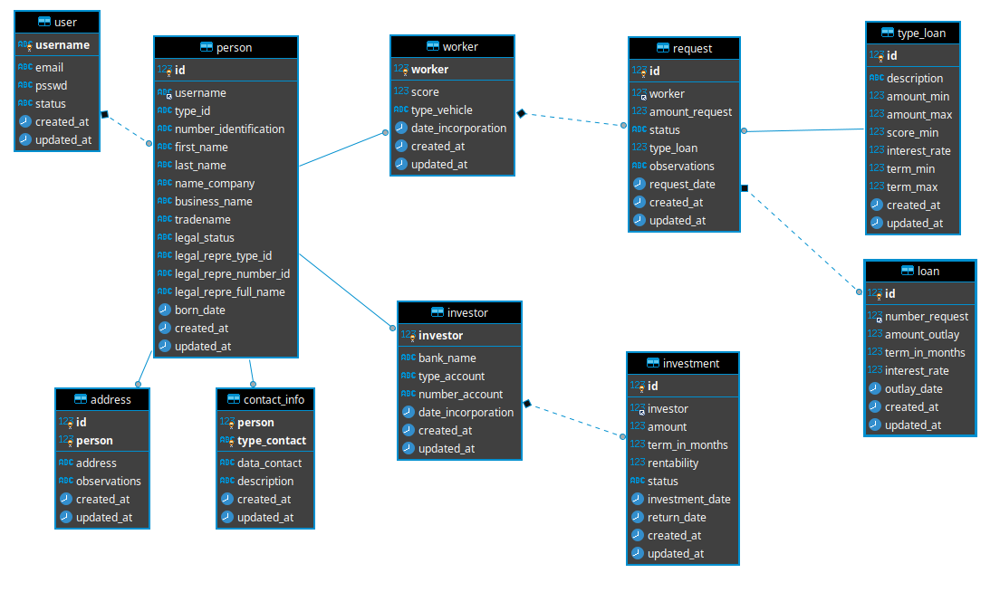

# RapScore

This is our Portfolio Project, concluding our Foundations Year at Holberton School

## Project Description

This project proposes a workforce based credit system, implementing technology and performance. The main goal is to facilitate fast loan access to workers based on their performance. We have two main participants. Investors and workers. Investors invest in the loan system based on the worker's score and workers will have access to the loan depending on their performance.

Conditions

Worker loans are given under a score performance. Loans can either be used for the purchase of new vehicles or vehicle restoration and/or fixes. Vehicles are meant to be used by the worker inside the platform's activity.

The main objective of our project is to deliver a product that measures workers efficiency for a performance based loan system. We will develop a system that will give a score that depends on different variables, for example, location, distance (km), time, amount of tasks and this will help investors safeguard their investment by loaning to high scoring ranked workers.

## API and Methods
 
GET: Create a new user.
* /signup/id

POST: Return accounts information.
* /users/id/profile

PUT: Update users information
* /users/id/profile/edit

GET:
* /users/id/profile/bank-details
* /users/id/profile/investment

GET: Return status for investors account.
* /users/id/profile/status

PUT: Create a new application form
* /users/id/profile/requests

GET: Return form details
* /users/id/profile/requests/loan-details

GET: Catch authentication and update credentials
* /signin
* /help/reset-login-password
* /signin/restore-password

PUT:
* /signin/restore-password/new

## Data Modeling

## Build With

* Python - Programming language
* Mysql - Databases
* Javascript
* HTML5
* CSS

## License

 MIT License 

Copyright (c) 2020 Kevin Brandown Castro

Permission is hereby granted, free of charge, to any person obtaining a copy
of this software and associated documentation files (the "Software"), to deal
in the Software without restriction, including without limitation the rights
to use, copy, modify, merge, publish, distribute, sublicense, and/or sell
copies of the Software, and to permit persons to whom the Software is
furnished to do so, subject to the following conditions:

The above copyright notice and this permission notice shall be included in all
copies or substantial portions of the Software. 

THE SOFTWARE IS PROVIDED "AS IS", WITHOUT WARRANTY OF ANY KIND, EXPRESS OR
IMPLIED, INCLUDING BUT NOT LIMITED TO THE WARRANTIES OF MERCHANTABILITY,
FITNESS FOR A PARTICULAR PURPOSE AND NONINFRINGEMENT. IN NO EVENT SHALL THE
AUTHORS OR COPYRIGHT HOLDERS BE LIABLE FOR ANY CLAIM, DAMAGES OR OTHER
LIABILITY, WHETHER IN AN ACTION OF CONTRACT, TORT OR OTHERWISE, ARISING FROM,
OUT OF OR IN CONNECTION WITH THE SOFTWARE OR THE USE OR OTHER DEALINGS IN THE
SOFTWARE.

## Authors
* Kevin Castro - [Github](https://github.com/KevinCastroP) / [Twitter](https://twitter.com/ccali_k)  
* Luis Herrera - [Github](https://github.com/lh1008) / [Twitter](https://twitter.com/lh1008)
* Jhonatan Legarda - [Github](https://github.com/steven-cruz) / [Twitter](https://twitter.com/JhonatanLegarda
)