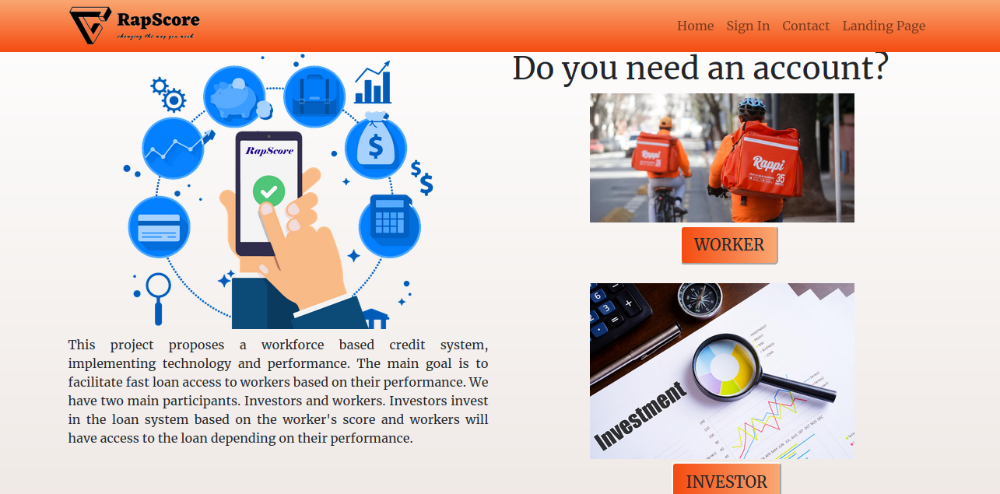

# RapScore

This is our Portfolio Project, concluding our Foundations Year at Holberton School

## Project Description

This project proposes a workforce based credit system, implementing technology and performance. The main goal is to facilitate fast loan access to workers based on their performance. We have two main participants. Investors and workers. Investors invest in the loan system based on the worker's score and workers will have access to the loan depending on their performance.

**Deployed Site**
[RapScore-Site](http://rapscore.glitch.me/home)

**Landing Page**
[Landing Page-Site](https://mixed-oasis-caterpillar.glitch.me/)

**Kevin Castro**
- [LinkedIn](https://www.linkedin.com/in/kevin-castro-a46996193/)
- [Final Project Blog](https://www.linkedin.com/posts/kevin-castro-a46996193_rapscore-final-project-activity-6681644008369872897-jvvp)

**Jhonatan Legarda**
- [LinkedIn](https://www.linkedin.com/in/jhonatan-legarda-3799a5193/)
- [Final Project Blog](https://medium.com/@stevencruz.300008/construction-of-the-rapscore-project-c24efb197a69)

**Luis Herrera**
- [LinkedIn](https://www.linkedin.com/in/lh1008/?locale=en_US)
- [Final Project Blog](https://medium.com/@lh1008/it-all-started-in-rapscore-a7923a840d82)

### Functionality

Worker loans are given under a score performance. Loans can either be used for the purchase of new vehicles or vehicle restoration and/or fixes. Vehicles are meant to be used by the worker inside the platform's activity.

The main objective of our project is to deliver a product that measures workers efficiency for a performance based loan system. We will develop a system that will give a score that depends on different variables, for example, location, distance (km), time, amount of tasks and this will help investors safeguard their investment by loaning to high scoring ranked workers.

---

## Installation

This project works was built using Ubuntu 19.10 but can be tested using Ubuntu 14.04. 

#### Requirements

- [MySQL](https://www.digitalocean.com/community/tutorials/how-to-install-mysql-on-ubuntu-18-04) database software administrator
- [SQLalchemy](https://docs.sqlalchemy.org/en/13/intro.html#installation)
- [Python3](https://docs.python-guide.org/starting/install3/linux/)
- FLASK ([installation](https://flask.palletsprojects.com/en/1.1.x/installation/#install-flask), no need to install `virtualenv`)
- [pip3](https://askubuntu.com/questions/778052/installing-pip3-for-python3-on-ubuntu-16-04-lts-using-a-proxy)

#### Getting Started

Git clone the repository to a local directory

`git clone https://github.com/KevinCastroP/RapScore_MVP.git`

`cd RapScore`
`export /web_static/FLASK_APP=rap_score.py`
`./runTest.sh`

In your browser type the following URL: http://0.0.0.0:5000/

---

### Usage

Once you have running the code, the site will be connected automatically to the database. Two profile options will be displayed. Choose `WORKER` or `INVESTOR`. Fill out the subcription form and `Submit`. You will be prompt to the profile site you hace chosen. Play around and check the different buttons you have. `WORKERS` profile cand edit clients details. `Log Out` and `Sign In` using the same credentials you first subscribed with, email and password. 

### Contributing

If you want to contribute fork the repository and create a branch in your local machine push it to your Github local account and make a [Pull Request](https://github.com/KevinCastroP/RapScore_MVP/pulls). You can also open an [Issue](https://github.com/KevinCastroP/RapScore_MVP/issues) suggesting changes.

## Related Projects

- [Users Lending](https://github.com/cybernuki/Users-Lending-Back)
- [Rappinvest](https://github.com/AlejandroArbelaez21/final_project)
- [HelpMePay](https://github.com/mateo-a/HelpMePay)

## Screenshot

## Data Modeling

### API and Methods
 
GET: Create a new user.
* /signup/id

POST: Return accounts information.
* /users/id/profile

PUT: Update users information
* /users/id/profile/edit

GET:
* /users/id/profile/bank-details
* /users/id/profile/investment

GET: Return status for investors account.
* /users/id/profile/status

PUT: Create a new application form
* /users/id/profile/requests

GET: Return form details
* /users/id/profile/requests/loan-details

GET: Catch authentication and update credentials
* /signin
* /help/reset-login-password
* /signin/restore-password

PUT:
* /signin/restore-password/new

## License

Public Domain. No copy write protection.

## Authors
* Kevin Castro - [Github](https://github.com/KevinCastroP) / [Twitter](https://twitter.com/ccali_k)  
* Luis Herrera - [Github](https://github.com/lh1008) / [Twitter](https://twitter.com/lh1008)
* Jhonatan Legarda - [Github](https://github.com/steven-cruz) / [Twitter](https://twitter.com/JhonatanLegarda)